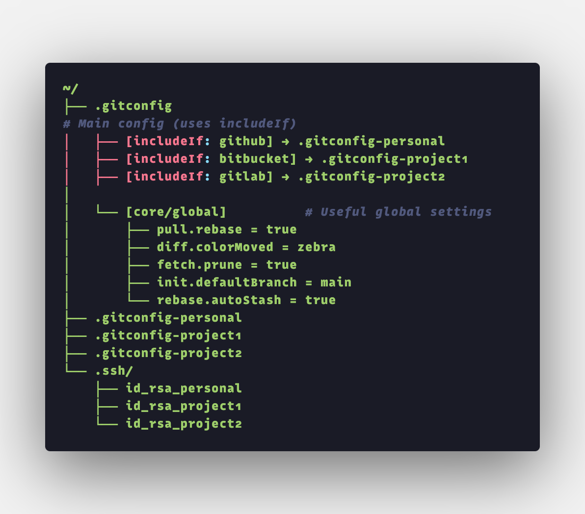

# 🧠 gitmeright

**Automatically use the right Git identity per project.**  
No more wrong emails, mismatched SSH keys, or accidental commits with your work account on side projects 😅

`gitmeright` helps you manage multiple Git identities — personal(github), project1 (Bitbucket), and project2 (GitLab) — all from a single, smart `.gitconfig`.

---

## ✨ What It Does

✔️ Automatically switches your Git config based on the remote URL  
✔️ Keeps work, freelance, and personal identities separate  
✔️ Prevents “oops wrong email” moments  
✔️ Adds aliases and fetch/prune tweaks for a smoother experience  
✔️ Works on macOS, Linux, WSL, and beyond

---

## 🗂️ Folder Structure

Here’s how it’s organized:



> This diagram shows how `.gitconfig` connects to different profile files and SSH keys based on your project.

---

## ⚙️ Example of a Main Config: `.gitconfig`

```ini
[includeIf "hasconfig:remote.*.url:git@github.com:your-user/**"]
    path = ".gitconfig-personal"

[includeIf "hasconfig:remote.*.url:git@bitbucket.org:project1/**"]
    path = ".gitconfig-project1"

[includeIf "hasconfig:remote.*.url:git@gitlab.com:project2/**"]
    path = ".gitconfig-project2"

[pull]
    rebase = true
[fetch]
    prune = true
[diff]
    colorMoved = zebra
[init]
    defaultBranch = main
[rebase]
    autoStash = true

[alias]
    co = checkout
    br = branch
    st = status
    lg = log --oneline --graph --all
```

## 🔧 Example of a Per-Project Config: `.gitconfig-project1`

```ini
[user]
    name = Your Project1 Name
    email = you@project1.com

[core]
    sshCommand = "ssh -i ~/.ssh/id_rsa_project1"
```

## 🛠 How to Set It Up

### Step 1: Clone the Repository

```bash
git clone https://github.com/s403o/gitmeright.git && cd gitmeright
```

### Step 2: Use the One-Line Setup Script

```bash
./setup.sh
```
