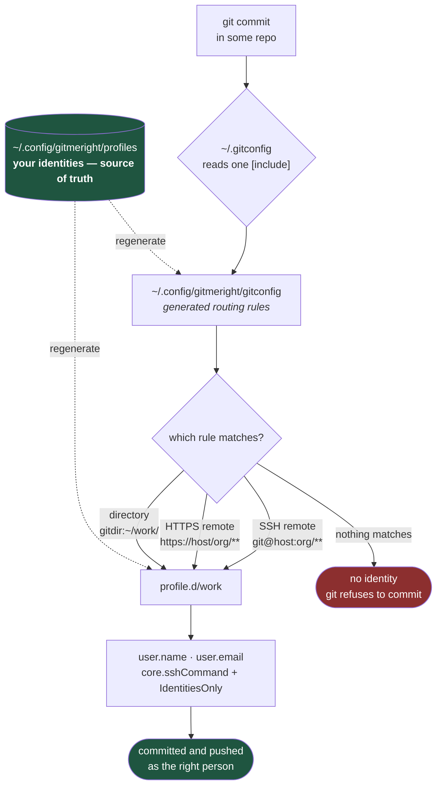

# 🧠 gitmeright

[](https://github.com/s403o/gitmeright/actions/workflows/test.yml)
[](LICENSE)
[](https://github.com/s403o/gitmeright/stargazers)

**The right git identity for the right project — automatically, and it can prove it.**

You have a personal GitHub, a work GitLab, and a client's Bitbucket. Git has one global
`user.email`. So one day you push to the client repo as `you@personal.com`, and you find
out three weeks later.

`gitmeright` sets up per-project identities and SSH keys so that never happens — and gives
you two commands nothing else has: **`whoami`** tells you which identity this repo
resolves to *and why*, and **`doctor`** finds the silent misconfigurations git will never
warn you about.

```bash
curl -fsSL https://raw.githubusercontent.com/s403o/gitmeright/main/install.sh | bash
gitmeright init
```

Nothing in your git config changes until you run `init`, and `init` backs up
`~/.gitconfig` before appending a single line to it.

---

## The part that makes it worth installing

Git will happily use the wrong identity and tell you nothing. An `includeIf` rule that
never matches produces **no warning, no error, and exit status 0**. When it goes wrong,
you get no signal at all.

```console
$ gitmeright whoami
repo      ~/clients/acme-api
remote    git@github.com:acme/api.git
profile   work
name      Eslam Adel
email     eslam@acme.com
key       ~/.ssh/id_ed25519_work (IdentitiesOnly: yes)
```

And when nothing matches — the case that actually costs you an afternoon:

```console
$ gitmeright whoami
repo      ~/side/experiment
remote    https://github.com/eslam/experiment.git
profile   ✗ none matched

git will refuse to commit here — that is deliberate.

rules checked:
  ✗ personal     host matches, org does not (expects s403o/)
  ✗ work         different host (expects gitlab.com)

fix: gitmeright add <label>, or point this repo at a matching remote.
```

`doctor` catches the rest — including the nastiest failure of all, where
`git config user.email` shows the *right* address while SSH authenticates as somebody
else:

```console
$ gitmeright doctor
  ✓ git version                        2.48.1 (remote-URL matching available)
  ✓ state file                         ~/.config/gitmeright/profiles (3 profiles)
  ✓ include in ~/.gitconfig            present, once
  ✓ global user.email                  unset — an unmatched repo fails loudly (intended)
  ✓ permissions on ~/.ssh              700

profiles
  ✓ personal resolves                  git@github.com:s403o/** → eslam.adel.me@gmail.com
  ✓ work resolves                      git@gitlab.com:acme/** → eslam@acme.com
  ✗ client key                         id_ed25519_client must be mode 600 — run: chmod 600 …
  ✓ work IdentitiesOnly                yes
```

Add `--online` and it connects to each host and tells you **which account answered**.

---

## Commands

| Command | What it does |
|---|---|
| `gitmeright init` | Set up your identities. Asks how many, then walks you through each. |
| `gitmeright add [label]` | Add one more identity later, without redoing anything. |
| `gitmeright remove <label>` | Drop an identity. Asks before deleting its SSH key. |
| `gitmeright list` | Every identity: email, what it matches, which key. |
| `gitmeright whoami` | Which identity does *this* repo use, and why. Exits non-zero if none. |
| `gitmeright doctor` | Full health check. `--online` also tests SSH against each host. |
| `gitmeright guard --install` | Block commits in this repo when no identity matches. |
| `gitmeright tweaks --install` | Optional opinionated git defaults (see below). |
| `gitmeright regenerate` | Rebuild generated config from your saved profiles. |
| `gitmeright uninstall` | Remove gitmeright's config. Keeps your SSH keys. |

Flags that work everywhere: `--dry-run` `--yes` `--non-interactive` `--quiet` `--help`
`--version`.

**`--dry-run` writes nothing at all** — not even state. Use it first if you'd rather see
what happens before it happens.

Scriptable, for dotfiles bootstraps:

```bash
gitmeright add work --name "Eslam Adel" --email eslam@acme.com \
  --host github.com --org acme --gitdir ~/work --non-interactive --yes
```

---

## How it works


```mermaid
flowchart TD
    A["git commit<br/>in some repo"] --> B{"~/.gitconfig<br/>reads one [include]"}
    B --> C["~/.config/gitmeright/gitconfig<br/><i>generated routing rules</i>"]

    C --> D{"which rule matches?"}
    D -->|"SSH remote<br/>git@host:org/**"| P1["profile.d/work"]
    D -->|"HTTPS remote<br/>https://host/org/**"| P1
    D -->|"directory<br/>gitdir:~/work/"| P1
    D -->|"nothing matches"| X(["no identity<br/>git refuses to commit"])

    P1 --> E["user.name · user.email<br/>core.sshCommand + IdentitiesOnly"]
    E --> F(["committed and pushed<br/>as the right person"])

    S[("~/.config/gitmeright/profiles<br/><b>your identities — source of truth</b>")] -.->|"regenerate"| C
    S -.->|"regenerate"| P1

    style S fill:#1f5540,color:#fff
    style F fill:#1f5540,color:#fff
    style X fill:#8c2f2f,color:#fff
```

**The red box is a feature.** gitmeright sets no fallback identity, so a repo matching no
rule cannot be committed to at all. That is the whole point — see
[Design principles](#design-principles).

Everything is generated from one file. `profiles` is the only thing you own; the routing
rules and identity blocks are derived from it and rebuilt by `gitmeright regenerate`, so
they are never hand-edited and never drift.

Three matching modes per identity, so it works whether or not you have a remote yet:

```ini
# by SSH remote
[includeIf "hasconfig:remote.*.url:git@github.com:acme/**"]
	path = ~/.config/gitmeright/profile.d/work
# by HTTPS remote — the URL GitHub's copy button gives you
[includeIf "hasconfig:remote.*.url:https://github.com/acme/**"]
	path = ~/.config/gitmeright/profile.d/work
# by directory — works before any remote exists
[includeIf "gitdir:~/work/"]
	path = ~/.config/gitmeright/profile.d/work
```

Each profile file sets your identity and pins the SSH key:

```ini
[user]
	name = Eslam Adel
	email = eslam@acme.com
[core]
	sshCommand = "ssh -i ~/.ssh/id_ed25519_work -o IdentitiesOnly=yes"
```

`IdentitiesOnly=yes` matters more than it looks. Without it, `ssh -i` only *adds* your key
to the candidate list — ssh still offers every other key it can find, and the server
accepts the first that works. That is how you end up committing from the right email under
the wrong account, with every obvious diagnostic saying you're fine.

### What it writes on your machine

```
~/.gitconfig                             ← ONE [include] line appended. Nothing else touched.
~/.gitconfig.gitmeright.bak.<timestamp>  ← taken before that line is added
~/.config/gitmeright/
├── profiles                             ← your identities — the only file you own
├── gitconfig                            ← generated routing rules
├── tweaks                               ← optional, only if you asked for it
└── profile.d/
    ├── personal                         ← generated identity blocks
    ├── work
    └── client
~/.ssh/id_ed25519_{personal,work,client} ← 600, and never overwritten
```

`gitmeright uninstall` removes the include line, restores the backup, and leaves your SSH
keys alone.

### This repository

```
bin/gitmeright         the whole tool — one bash file, no dependencies
install.sh             the one-liner installer
test/
├── helper.bash        sandboxed $HOME + fixture-repo helpers
├── unit.bats          validators, version compare, path normalisation
├── resolution.bats    does git resolve the right identity? (the product promise)
├── safety.bats        regressions for every destructive/injection bug in 1.x
└── cli.bats           whoami, doctor, guard, flags
.github/workflows/     4-platform matrix + ShellCheck + end-to-end install check
```

---

## Design principles

**1. A profile miss fails loudly.** gitmeright sets no global `user.email`. If a repo
matches no profile, git refuses to commit:

```
*** Please tell me who you are.
```

That looks like a bug and is the entire point. Committing under the wrong identity is the
failure this tool exists to prevent; refusing to commit is always the better error. Run
`gitmeright whoami` and it tells you exactly which rule missed and by how much.

This is enforced with `user.useConfigOnly = true`. Without it git does not fail at all — it
quietly invents an identity from your username and hostname and commits with *that*, which
is the same silent-wrong-author problem in a different hat.

**2. Your config is never destroyed.** `~/.gitconfig` is backed up to
`~/.gitconfig.gitmeright.bak.<timestamp>` before a single line is appended. Your aliases,
signing key, credential helper and proxy settings all survive. `uninstall` puts it back
byte-for-byte.

**3. Nothing opinionated rides along.** `pull.rebase = true` and friends are *not*
installed unless you ask for them with `gitmeright tweaks --install`, and `uninstall`
reverses them.

**4. Your SSH keys are never overwritten or deleted** without asking, including on
uninstall.

---

## Requirements

- **git 2.36+** for remote-URL matching. On 2.13–2.35 gitmeright says so and switches to
  directory rules, which work back to 2.13 (2017).
- **bash** — 3.2 is fine, which is what macOS ships.
- Linux, macOS and WSL. All are in [CI](.github/workflows/test.yml); the matrix is the
  support claim, not the README.

---

## Upgrading from the old `setup.sh`

Versions before 2.0 shipped a `setup.sh` that **overwrote `~/.gitconfig` with no backup**
and, on macOS, silently failed to substitute your name and email — leaving a config that
literally read `email = you@personal.com` while printing `✅ Setup complete!`.

If you ran it:

1. Check what you're actually committing as — `git config user.email` inside a repo, or
   `gitmeright doctor` once you've upgraded.
2. If your `~/.gitconfig` was overwritten, look for a `.bak` beside it. The old script
   deleted its own backups, so if there is none you'll need to re-add your aliases and
   credential helper by hand. Sorry — that one is on us.
3. Install 2.0 and run `gitmeright init`. The old `~/.gitconfig-*` files are no longer
   used and can be deleted once `doctor` is green.

The full list of what changed is in the [CHANGELOG](CHANGELOG.md).

---

## FAQ

**Does this work if I use HTTPS instead of SSH?**
Yes — a rule is written for both URL forms. SSH keys are optional; answer *no* when asked
for a dedicated key and you'll get identity switching without any key management.

**I already have a `~/.gitconfig` I care about.**
It survives. gitmeright appends one `[include]` line and backs the file up first. Run
`gitmeright init --dry-run` if you'd like to see exactly what would change before anything
does.

**Why does git say "Please tell me who you are" in some repos?**
That repo matches no profile, and gitmeright deliberately sets no fallback identity — a
loud failure beats a commit under the wrong name. `gitmeright whoami` will tell you which
rule missed and why.

**How is this different from just writing `includeIf` rules myself?**
The rules are the easy part. The hard part is that git gives you *no way to ask* which rule
matched — an `includeIf` that never fires produces no warning and exit status 0. `whoami`
and `doctor` are the answer to that, and they're the reason this is a tool and not a gist.

**Does it work with multiple accounts on the same host?**
Yes — profiles are keyed on host *and* org, so `github.com/personal` and `github.com/acme`
are separate identities with separate keys.

**Can I use it in a dotfiles bootstrap?**
Yes. Every command takes `--non-interactive` and explicit flags; see the scriptable example
above.

---

## Contributing

See [CONTRIBUTING.md](CONTRIBUTING.md). In short: `bats test/`, ShellCheck clean, bash 3.2
compatible, and every new behaviour needs a test that asserts through `git config` rather
than grepping a file.

Security issues: please report them privately — see [SECURITY.md](SECURITY.md).

## License

MIT © [s403o](https://github.com/s403o) — see [LICENSE](LICENSE).
